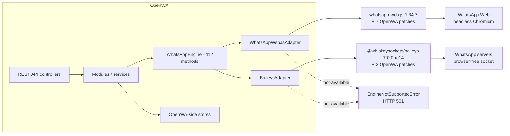
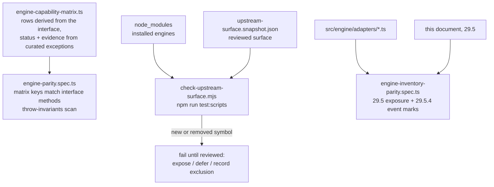

# 29 - Engine Capability Matrix

Three-way comparison of every capability: the **Baileys library** (`@whiskeysockets/baileys`
7.0.0-rc14), the **whatsapp-web.js library** (1.34.7), and what **OpenWA actually exposes** through
its adapter layer and REST API — including which "supported" cells only work because OpenWA patches
the installed library. Coverage is total: all 112 `IWhatsAppEngine` methods (29.4), **all 152
Baileys + 81 whatsapp-web.js library methods** (29.5), all 34 + 31 library events (29.5.4), and all
9 install-time patches (29.3). If it exists upstream or in OpenWA, it has a row here.

## 29.1 How to read this matrix

Statuses used in the tables:

- **✅** — works end-to-end through the OpenWA adapter.
- **✅🔧ⁿ** — works end-to-end, but **only because OpenWA patches the installed library** (patch
  `🔧ⁿ`, see 29.3). On a stock, unpatched install of the library this cell would be broken.
- **❌ gap** — _adapter-gap_: the underlying library HAS the capability; only the OpenWA adapter
  wiring is missing. Fixable in this repo.
- **❌ lib** — _library-limitation_: the underlying library exposes no first-class symbol for the
  operation. Not fixable without raw-proto/fork work or an event-cache hack.
- **OpenWA REST** column — what a caller of the REST API gets: **✅** on any engine session,
  **⚠️ `<engine>` only** when the answer depends on the session's engine (the other engine
  answers HTTP 501), **❌ 501** on both engines, and **⚙️ internal** for a method the REST surface
  never exposes because the gateway calls it itself (`probeLiveness`).

Two complementary views:

- **29.4 — the OpenWA contract view.** Rows are the 112 `IWhatsAppEngine` methods; use it to see
  what a REST caller gets per engine. Source of truth: `src/engine/engine-capability-matrix.ts`
  (per-cell `evidence` strings cite the exact library `file:symbol` inspected).
- **29.5 — the full engine inventory.** Rows are **every method the installed libraries expose**,
  each mapped to the OpenWA interface method that uses it (or marked unexposed). Use it as the
  implementation backlog: anything `❌ not exposed` with a library symbol behind it is wiring work,
  not research work. 29.5.3 distills the sweetest spot: capabilities **both** libraries already
  have and only OpenWA lacks.

## 29.2 Adapter architecture

OpenWA never calls a WhatsApp library directly from a controller. Every session owns one engine
instance behind the neutral `IWhatsAppEngine` interface (112 methods +
`EngineEventCallbacks`), and all modules go through it:

Key adapter facts:

- **Engine is chosen per session** (`wwjs` is the default, `baileys` the browser-free alternative).
  The REST surface is identical for both; availability differences surface only as 501s, which the
  matrix in 29.4 enumerates.
- **The 501 contract is deliberate.** A capability the engine cannot deliver throws
  `EngineNotSupportedError` (HTTP 501) at the adapter boundary — never a fabricated success, and
  never a stub returning `null`/`[]` that a caller reads as an answer. `engine-parity.spec.ts`
  enforces the biconditional in both directions: a cell is `not-available` if and only if the
  adapter method throws, so a row cannot quietly stop throwing.
- **The two adapters are structured differently.** `WhatsAppWebJsAdapter` methods are thin forwarders to
  delegate modules (`wwebjs-catalog.ts`, `wwebjs-groups.ts`, …), so their throws live in the
  delegates. `BaileysAdapter` throws inline via `this.unsupported(...)`. The drift gate below
  covers both shapes: besides the `Class.prototype.method.toString()` throw-scan it derives a
  throw registry from the `EngineNotSupportedError('method')` / `this.unsupported('method')`
  literals in every adapter and delegate source file (`engine-parity.spec.ts`), so a throw in a
  delegate is machine-checked exactly like an inline one. Two refinements: the literal must be a
  plain single-quoted string naming the refused method (a template-literal or variable-argument
  construction fails the gate outside the one `unsupported()` helper body, as does a literal that
  names no interface method), and a refusal
  that fires only under a runtime condition - `sendTextMessage` with `customPreview` on whatsapp-web.js -
  is pinned in the gate's conditional list instead of flipping the cell, because 'supported with a
  refused option' is not 'not-available'.
- **Inbound events** flow the other way: each adapter normalizes library events into the neutral
  `EngineEventCallbacks` (`onMessage`, `onMessageAck`, `onGroupEvent`, `onCall`, …), which the
  session module turns into OpenWA webhook events. Which library events are consumed — and which
  are dropped — is listed in 29.5.4.
- **Some REST reads bypass the engine entirely.** `GET …/status` reads are served from
  `StatusStoreService` (fed by inbound ingestion on both engines), so status-read parity holds at
  the API level even where the Baileys adapter cells are `❌ lib`. These rows are marked
  `✅ (store) ‡`.

Three automated gates keep the matrix honest:

`engine-parity.spec.ts` guarantees every interface method has exactly one matrix row (and vice
versa) and checks the throw-invariants it can observe. `check-upstream-surface.mjs` extracts the
installed libraries' public surface and fails on any drift from the reviewed snapshot, so an
engine bump cannot smuggle in an unreviewed capability **within the surface it reads** — which is
four lists and no more: the `export class Client` block of whatsapp-web.js's `index.d.ts`, its
`Constants.js` event values, Baileys' `lib/Socket/*.d.ts` members and `lib/Types/Events.d.ts`.
Anything upstream outside those is invisible to it, including symbols this page cites as evidence:
`Message.vote` (29.6.1) sits on the `Message` interface, and the `chatModify({mute})`/`({pin})`
shapes in 29.5.3 live in `lib/Types/Chat.d.ts`, which no extractor opens. A version bump whose
extracted surface is unchanged passes with a note, by design — there is nothing new to review.
Neither of those two reads this document — status changes land in the matrix first, then here.

`engine-inventory-parity.spec.ts` is the one gate that **does** read this page, because 29.5's two
right-hand columns are hand-filled and nothing else could see them drift. It asserts that every
symbol marked ✅/⚙️ appears in adapter code rather than only in a comment, that every interface
method named in a ✅ cell is `supported` for that engine in the matrix, and that the ✅ marks in
29.5.4 match the events the adapters actually register. Its limits are deliberate and worth knowing
before trusting a green run: it cannot see **under-mapping** (a ✅ row listing four interface
methods where the symbol really serves eight still passes), it cannot separate a library symbol
from an adapter method of the same name (`logout`), and it cannot see a mapping pointed at the
wrong interface method. Those three remain reader-verified.

## 29.3 Install-time patches OpenWA applies to the libraries

OpenWA ships nine exact, self-disabling source transforms over the installed engines. Each runs at
`npm install` (`scripts/postinstall.js`, `--best-effort`) and again in the Docker production stage
(**without** best-effort — dependency drift fails the image build). "Self-disabling" means the
patcher no-ops once the fix is present upstream, and an unrecognized source shape fails loudly
rather than shipping a silently partial patch.

"Fails loudly" holds for the image build, not for `npm install`, where `--best-effort` turns a
refusal into one line of a long transcript. So each patcher also exports an `isApplied()` predicate,
its own stand-down branch read back against the installed file, and each engine reports the patches
it is missing as it starts (`src/engine/adapters/engine-patch-status.ts`; 🔧¹ keeps the separate
check described below). The report is diagnostic, not preventive: startup continues, so a session
reaching READY is not evidence that every patch landed. See docs/12 for the operator procedure.

### 29.3.1 The nine patches

| #   | Patcher                                                    | Library target                       | What it repairs                                                                                                                                                                                                                                                                                                                                                                                                                                                                                                                                                                                                                                                                                                                                                                                                                                                                                                                                                                                                                                                                                                                                    | Stand-down predicate                                                                                                                                                                                                                                                                                                                                                  |
| --- | ---------------------------------------------------------- | ------------------------------------ | -------------------------------------------------------------------------------------------------------------------------------------------------------------------------------------------------------------------------------------------------------------------------------------------------------------------------------------------------------------------------------------------------------------------------------------------------------------------------------------------------------------------------------------------------------------------------------------------------------------------------------------------------------------------------------------------------------------------------------------------------------------------------------------------------------------------------------------------------------------------------------------------------------------------------------------------------------------------------------------------------------------------------------------------------------------------------------------------------------------------------------------------------- | --------------------------------------------------------------------------------------------------------------------------------------------------------------------------------------------------------------------------------------------------------------------------------------------------------------------------------------------------------------------- |
| 🔧¹ | `scripts/patch-wwebjs-201832.js` (+ `wwebjs-201832.patch`) | whatsapp-web.js models               | WhatsApp Web 2.3000.x renamed the serialized message-id property `id._serialized` → `id.$1`; 1.34.7 reads the old name in the `Message` constructor and ~40 downstream sites, so message ids, acks, quoted-message resolution and media downloads break. Backports upstream fix #201832 (`Base._normalizeId()`). One known harmless reject on 1.34.7 (a LID-aware `Contact.js` path that does not exist there); any other reject aborts the build.                                                                                                                                                                                                                                                                                                                                                                                                                                                                                                                                                                                                                                                                                                 | no-ops once `_normalizeId` exists upstream. Runtime double-check: `src/engine/adapters/wwebjs-backport-check.ts` detects an unpatched install and logs an error naming the fix as the wwjs session starts (`whatsapp-web-js.adapter.ts:446`). It is diagnostic, **not** preventive — startup continues, so a session reaching READY is not evidence the patch landed. |
| 🔧² | `scripts/patch-wwebjs-status.js`                           | whatsapp-web.js injected status send | Two independent breakages in current WhatsApp Web builds: (1) the `canCheckStatusRankingPosterGating()` helper is gone and its call threw before any status send — now called when present, `false` (pre-gating meaning) when not; (2) `sendStatusMediaMsgAction` changed signature from positional `(msg, mediaUpdate)` to a single options object — adopted from upstream PR #201816. The two edits of the media repair are all-or-nothing.                                                                                                                                                                                                                                                                                                                                                                                                                                                                                                                                                                                                                                                                                                      | exact-shape match; unknown shape fails the build.                                                                                                                                                                                                                                                                                                                     |
| 🔧³ | `scripts/patch-wwebjs-newsletter-preview.js`               | whatsapp-web.js `Injected/Utils.js`  | Link-preview generation omitted the destination chat, so WhatsApp Web could not select the newsletter preview transport: `getLinkPreview(link)` → `getLinkPreview(link, chat)`.                                                                                                                                                                                                                                                                                                                                                                                                                                                                                                                                                                                                                                                                                                                                                                                                                                                                                                                                                                    | exact-shape match; unknown shape fails the build.                                                                                                                                                                                                                                                                                                                     |
| 🔧⁴ | `scripts/patch-wwebjs-ready-sync.js`                       | whatsapp-web.js readiness pipeline   | Two live-observed races: on a warm profile the page can reach `hasSynced=true` before the edge listener attaches (the whole post-auth pipeline silently never runs), and a partial `attachEventListeners` failure was swallowed (message bridge dead while sends still work). Adds an `eventsAttached` completion marker and fires the handler once when the level is already true; double-fire is deduped by the adapter.                                                                                                                                                                                                                                                                                                                                                                                                                                                                                                                                                                                                                                                                                                                         | exact-shape, one group all-or-nothing; unknown shape fails the build.                                                                                                                                                                                                                                                                                                 |
| 🔧⁵ | `scripts/patch-baileys-appstate.js`                        | Baileys `lib/Socket/chats.js`        | `resyncAppState`'s `while (collectionsToHandle.size)` loop: `query()` resolves `undefined` on its own 60s timeout, decoding to `{}`, and every loop exit — including the library's own attempts guard — lives inside `for (const key in decoded)`, which never runs on an empty decode. The loop would burn one 60s query per pass for the life of the socket (~1000 wasted queries/day). The patch adds the missing exit: empty decode → `break`.                                                                                                                                                                                                                                                                                                                                                                                                                                                                                                                                                                                                                                                                                                 | exact-shape match; remove once upstream bounds the loop.                                                                                                                                                                                                                                                                                                              |
| 🔧⁶ | `scripts/patch-baileys-newsletter-create.js`               | Baileys `lib/Socket/newsletter.js`   | `parseNewsletterCreateResponse` reads `thread.picture.id` eagerly, but `newsletterCreate` sends only `{ name, description }` — there is no picture parameter anywhere in the chain — so `thread.picture` is null on EVERY create and the parse threw for all of them. WhatsApp creates the newsletter server-side BEFORE the response is parsed, so each call returned 500 while leaving a real channel behind, and `createChannel` is non-idempotent, so a client retrying a 5xx leaked one orphan per attempt (confirmed on the test account). `description` has the same defect whenever the caller omits one. The patch reads every nested field defensively so the response's `id` — the only place the new channel's id appears — always survives.                                                                                                                                                                                                                                                                                                                                                                                           | exact-shape match; remove once upstream tolerates a pictureless newsletter.                                                                                                                                                                                                                                                                                           |
| 🔧⁷ | `scripts/patch-wwebjs-participant-arity.js`                | whatsapp-web.js `GroupChat.js`       | `removeParticipants`/`promoteParticipants`/`demoteParticipants` resolve each requested id against the group's own member collection and drop what they cannot find, then resolve `{status: 200}` for the batch. Dropping EVERY id left the WA Web request builder an empty repeated field, whose arity assertion threw — the caller saw an unnamed `500` on removal. Promote and demote have no such assertion, so they answered `200` claiming success for people WhatsApp never touched. The patch keeps the resolved array with its holes, skips the call when nothing resolved, and returns `matched` (one boolean per REQUESTED id) so the adapter can report a per-participant outcome instead of inventing one.                                                                                                                                                                                                                                                                                                                                                                                                                             | exact-shape match; remove once upstream reports which participants it acted on.                                                                                                                                                                                                                                                                                       |
| 🔧⁸ | `scripts/patch-wwebjs-block.js`                            | whatsapp-web.js `Contact.js`         | `Contact.block()`/`unblock()` resolved their target through `getContactToBlockOnlyUseIfNoAssociatedChat`, which WhatsApp Web removed, so both answered an opaque `500` for every id shape. The replacement helpers `handleBlock`/`handleUnblock` are modal-driven UI wrappers that block nothing when called headless, and the server now refuses a phone-keyed block outright (`trying to block a pn contact without a chat`) because individual chats are keyed by LID while wwjs folds every id back to a phone number. Resolves through `WAWebLidMigrationUtils.toUserLid` to the chat-owning identity and calls `blockContact`/`unblockContact` directly, falling back to the original contact when no LID or chat exists.                                                                                                                                                                                                                                                                                                                                                                                                                    | exact-shape match on both bodies; unknown shape fails the build.                                                                                                                                                                                                                                                                                                      |
| 🔧⁹ | `scripts/patch-wwebjs-group-description.js`                | whatsapp-web.js `GroupChat.js`       | `GroupChat.setDescription()` calls the page's `WAWebGroupModifyInfoJob.setGroupDescription(chatWid, description, newId, descId)` positionally, but that job now takes a single options object `{desc, groupWid, newDescId, prevDescId}`. The first positional argument lands where the object is read, every field comes back undefined, and `widToGroupJid(undefined)` throws inside the page — reaching the caller as a bare `500` while the library still types the method `Promise<boolean>`. `setGroupSubject` in the same module is still positional, which is why subjects kept working and made the Wid look innocent. The patch sends the options object, takes `newDescId` from `WARandomHex.randomHex(8)` as the product does, and maps an empty description to `desc: null` so it selects the job's delete branch rather than sending an empty body element. The open upstream fix #201895 changes the same call, but keeps `WAWebMsgKey.newId()` and passes an empty description through verbatim, so this patcher will not stand down when it lands and the `desc: null` mapping has to be carried over rather than dropped with it. | exact-shape match; unknown shape fails the build.                                                                                                                                                                                                                                                                                                                     |

### 29.3.2 Which matrix rows depend on which patch

This is the patch visibility the matrix cells refer to. Every patch is engine-specific (7 on wwjs,
2 on Baileys), and **no row carries a row-level patch mark on both engines**. The two column-wide
patches are a separate matter: 🔧¹ underwrites every wwjs cell and 🔧⁵ every baileys cell, so in
that sense every row does depend on a patch on each side. "Patch-dependent" below means the
row-level marks.

| Patch                       | Matrix rows that depend on it                                                                                                                                                                                                                                                                                                                          |
| --------------------------- | ------------------------------------------------------------------------------------------------------------------------------------------------------------------------------------------------------------------------------------------------------------------------------------------------------------------------------------------------------ |
| 🔧¹ message-id backport     | **The whole wwjs column** (header-marked, not repeated per row): every wwjs cell that sends, receives or resolves a message id. On unpatched 1.34.7 against WhatsApp Web ≥ 2.3000.x, sends return no message object and chat/media reads throw the minified `r: r`. Not row-specific, so the wwjs column header carries `🔧¹`.                         |
| 🔧² status-send repair      | `postTextStatus`, `postImageStatus`, `postVideoStatus`, `postVoiceStatus` — **wwjs cells only**. Stock 1.34.7 throws before any status send on current WhatsApp Web builds. These four rows are ✅ on both engines, but the wwjs side works only because of this patch.                                                                                |
| 🔧³ newsletter link preview | `sendTextMessage` (and any send carrying a link preview) **to a channel JID** on wwjs. Row-marked on `sendTextMessage` as the common case.                                                                                                                                                                                                             |
| 🔧⁴ ready-sync              | `initialize` on wwjs (warm-restore readiness race). Row-marked.                                                                                                                                                                                                                                                                                        |
| 🔧⁵ app-state resync bound  | No single row — keeps the Baileys socket's app-state resync from spinning (~1000 wasted 60s queries/day). Connection health under **every baileys cell**; the baileys column header carries `🔧⁵`.                                                                                                                                                     |
| 🔧⁶ newsletter-create parse | `createChannel` on **baileys** — without it the call always answers 500 and leaks the channel it just created. Row-marked.                                                                                                                                                                                                                             |
| 🔧⁷ participant arity       | `removeParticipants`, `promoteParticipants`, `demoteParticipants` on **wwjs**. Without it a request naming only non-members throws an arity assertion on removal, and promote/demote answer `200` for people WhatsApp never touched; the patch returns one boolean per REQUESTED id so the adapter reports a real per-participant outcome. Row-marked. |
| 🔧⁹ group description       | `setGroupDescription` on **wwjs**. Without it every call throws in the page and answers a bare `500`, so the capability is dead rather than degraded; `setGroupSubject` beside it is unaffected. Row-marked.                                                                                                                                           |
| 🔧⁸ block/unblock           | `blockContact`, `unblockContact` on **wwjs**. Without it both answer an opaque `500` on every id, so the capability is dead rather than degraded; the blocklist read still works, which makes the failure look one-sided.                                                                                                                              |

Rows that are ✅ on **both** engines where one side is patch-dependent: `initialize` (🔧⁴ wwjs),
`sendTextMessage` (🔧³ wwjs), `postTextStatus` / `postImageStatus` / `postVideoStatus` /
`postVoiceStatus` (🔧² wwjs), `removeParticipants` / `promoteParticipants` / `demoteParticipants`
(🔧⁷ wwjs), `setGroupDescription` (🔧⁹ wwjs). Everything else that is ✅-both carries no row-level mark, but still
rests on the column-wide 🔧¹ (wwjs) and 🔧⁵ (baileys) — no row runs on stock library code on both
sides.

### 29.3.3 Why no patch surfaces `transferChannelOwnership`'s swallowed reason

`Client.transferChannelOwnership` swallows WhatsApp's own refusal reason —
`contact-not-found-in-newsletter-subscriber-list` — into a bare `false`, so the caller gets a 403
with no cause. A patch to surface it looks obviously worthwhile, and it is not. The counts that
rule it out are below, because the case is attractive enough to be proposed again.

Parsing every `async` method in `Client.js` for a catch that returns `false` finds **five**, all in
the channel cluster. Four of them — `acceptChannelAdminInvite`, `revokeChannelAdminInvite`,
`demoteChannelAdmin`, `deleteChannel` — catch **only** `ServerStatusCodeError` and rethrow everything
else, which is the behaviour we would want and the same shape as `deleteProfilePicture`. The
indiscriminate `catch (ignoredError) { return false; }` appears **once**, in
`transferChannelOwnership` (`Client.js:2627`).

So it is not a house style, and the one method carrying it is the one OpenWA answers 501 for and
never invokes (29.6.2). The patch would repair a path our code does not take. It is also not an
upstream oversight but a deliberate design choice — a boolean return means discarding the cause — so
unlike 🔧⁶ there is no upstream fix that would ever retire it.

One real defect did fall out of that count and is **not** patch-shaped: `deleteChannel`'s page body
opens `if (!channel) return false;` before its try, so its `false` conflates _channel not found_ with
_WhatsApp refused_, and the adapter answers 403 for both. That distinction is ours to make in our own
adapter and involves no library change.

## 29.4 Full capability matrix — the OpenWA contract view (112 methods)

Legend recap: **✅** supported · **✅🔧ⁿ** supported via OpenWA patch `🔧ⁿ` (29.3) ·
**❌ gap** adapter-gap · **❌ lib** library-limitation. Column headers carry the engine-wide
patch dependencies (🔧¹ message-id backport on wwjs; 🔧⁵ app-state bound on
Baileys). The **OpenWA REST** column reads from the caller's side: ✅ works whatever engine the
session runs; ⚠️ depends on the session engine; ❌ 501 on both.

### 29.4.1 Session & connection

| Method               | Baileys adapter 🔧⁵ | wwjs adapter 🔧¹ | OpenWA REST |
| -------------------- | ------------------- | ---------------- | ----------- |
| `initialize`         | ✅                  | ✅🔧⁴            | ✅          |
| `disconnect`         | ✅                  | ✅               | ✅          |
| `logout`             | ✅                  | ✅               | ✅          |
| `destroy`            | ✅                  | ✅               | ✅          |
| `forceDestroy`       | ✅                  | ✅               | ✅          |
| `getQRCode`          | ✅                  | ✅               | ✅          |
| `requestPairingCode` | ✅                  | ✅               | ✅          |
| `getStatus`          | ✅                  | ✅               | ✅          |
| `probeLiveness`      | ✅ local            | ✅ round trip    | ⚙️ internal |

`probeLiveness` is the one optional member of `IWhatsAppEngine`, and the two adapters answer it to
different depths — which is what the optional marker exists to allow. wwjs races a real
`Client.getState()` round trip against a 10s timeout, because a wedged page keeps reporting
CONNECTED. Baileys returns a local check (`status === READY && sock != null`), because its keepalive
already emits a close event within ~35s. So a wedged wwjs page is caught here; a wedged Baileys
socket is caught by the transport instead. No REST route: the session watchdog polls it.

### 29.4.2 Sending messages

| Method                | Baileys adapter 🔧⁵ | wwjs adapter 🔧¹ | OpenWA REST     |
| --------------------- | ------------------- | ---------------- | --------------- |
| `sendTextMessage`     | ✅                  | ✅🔧³            | ✅              |
| `sendImageMessage`    | ✅                  | ✅               | ✅              |
| `sendVideoMessage`    | ✅                  | ✅               | ✅              |
| `sendAudioMessage`    | ✅                  | ✅               | ✅              |
| `sendDocumentMessage` | ✅                  | ✅               | ✅              |
| `sendStickerMessage`  | ✅                  | ✅               | ✅              |
| `sendContactMessage`  | ✅                  | ✅               | ✅              |
| `sendLocationMessage` | ✅                  | ✅               | ✅              |
| `sendPollMessage`     | ✅                  | ✅               | ✅              |
| `sendProduct`         | ✅                  | ❌ lib           | ⚠️ baileys only |
| `sendCatalog`         | ❌ lib              | ❌ lib           | ❌ not exposed  |
| `replyToMessage`      | ✅                  | ✅               | ✅              |
| `forwardMessage`      | ✅                  | ✅               | ✅              |
| `sendChatState`       | ✅                  | ✅               | ✅              |
| `sendSeen`            | ✅                  | ✅               | ✅              |

### 29.4.3 Message management

| Method                | Baileys adapter 🔧⁵ | wwjs adapter 🔧¹ | OpenWA REST  |
| --------------------- | ------------------- | ---------------- | ------------ |
| `editMessage`         | ✅                  | ✅               | ✅           |
| `deleteMessage`       | ✅                  | ✅               | ✅           |
| `reactToMessage`      | ✅                  | ✅               | ✅           |
| `starMessage`         | ✅                  | ✅               | ✅           |
| `pinMessage`          | ✅                  | ✅               | ✅           |
| `unpinMessage`        | ✅                  | ✅               | ✅           |
| `getMessageReactions` | ❌ lib              | ✅               | ⚠️ wwjs only |
| `votePoll`            | ❌ lib              | ✅               | ⚠️ wwjs only |

### 29.4.4 Chats

| Method              | Baileys adapter 🔧⁵ | wwjs adapter 🔧¹ | OpenWA REST  |
| ------------------- | ------------------- | ---------------- | ------------ |
| `getChats`          | ✅                  | ✅               | ✅           |
| `getChatHistory`    | ❌ lib              | ✅               | ⚠️ wwjs only |
| `archiveChat`       | ✅                  | ✅               | ✅           |
| `clearChatMessages` | ✅                  | ✅               | ✅           |
| `deleteChat`        | ✅                  | ✅               | ✅           |
| `markUnread`        | ✅                  | ✅               | ✅           |
| `muteChat`          | ✅                  | ✅               | ✅           |
| `pinChat`           | ✅                  | ✅               | ✅           |

### 29.4.5 Contacts

| Method                | Baileys adapter 🔧⁵ | wwjs adapter 🔧¹ | OpenWA REST |
| --------------------- | ------------------- | ---------------- | ----------- |
| `getContacts`         | ✅                  | ✅               | ✅          |
| `getContactById`      | ✅                  | ✅               | ✅          |
| `upsertContact`       | ✅                  | ✅               | ✅          |
| `deleteContact`       | ✅                  | ✅               | ✅          |
| `blockContact`        | ✅                  | ✅               | ✅          |
| `unblockContact`      | ✅                  | ✅               | ✅          |
| `getBlockedContacts`  | ✅                  | ✅               | ✅          |
| `checkNumberExists`   | ✅                  | ✅               | ✅          |
| `getNumberId`         | ✅                  | ✅               | ✅          |
| `getPhoneNumber`      | ✅                  | ✅               | ✅          |
| `getPushName`         | ✅                  | ✅               | ✅          |
| `resolveContactPhone` | ✅                  | ✅               | ✅          |
| `getProfilePicture`   | ✅                  | ✅               | ✅          |

### 29.4.6 Groups

| Method                           | Baileys adapter 🔧⁵ | wwjs adapter 🔧¹ | OpenWA REST     |
| -------------------------------- | ------------------- | ---------------- | --------------- |
| `createGroup`                    | ✅                  | ❌               | ✅              |
| `getGroups`                      | ✅                  | ✅               | ✅              |
| `getGroupInfo`                   | ✅                  | ✅               | ✅              |
| `addParticipants`                | ✅                  | ✅               | ✅              |
| `removeParticipants`             | ✅                  | ✅🔧⁷            | ✅              |
| `promoteParticipants`            | ✅                  | ✅🔧⁷            | ✅              |
| `demoteParticipants`             | ✅                  | ✅🔧⁷            | ✅              |
| `approveGroupMembershipRequests` | ✅                  | ✅               | ✅              |
| `rejectGroupMembershipRequests`  | ✅                  | ✅               | ✅              |
| `getGroupMembershipRequests`     | ✅                  | ✅               | ✅              |
| `leaveGroup`                     | ✅                  | ✅               | ✅              |
| `getGroupInviteCode`             | ✅                  | ✅               | ✅              |
| `joinGroupViaInviteCode`         | ✅                  | ✅               | ✅              |
| `revokeGroupInviteCode`          | ✅                  | ✅               | ✅              |
| `getGroupJoinInfo`               | ✅                  | ✅               | ✅              |
| `setGroupSubject`                | ✅                  | ✅               | ✅              |
| `setGroupDescription`            | ✅                  | ✅🔧⁹            | ✅              |
| `setGroupPicture`                | ✅                  | ✅               | ✅              |
| `deleteGroupPicture`             | ✅                  | ✅               | ✅              |
| `setGroupMessagesAdminsOnly`     | ✅                  | ✅               | ✅              |
| `setGroupInfoAdminsOnly`         | ✅                  | ✅               | ✅              |
| `setGroupMemberAddMode`          | ✅                  | ✅               | ✅              |
| `setGroupEphemeral`              | ✅                  | ❌ lib           | ⚠️ baileys only |

### 29.4.7 Channels

| Method                     | Baileys adapter 🔧⁵ | wwjs adapter 🔧¹ | OpenWA REST     |
| -------------------------- | ------------------- | ---------------- | --------------- |
| `createChannel`            | ✅🔧⁶               | ✅               | ✅              |
| `deleteChannel`            | ✅                  | ✅               | ✅              |
| `muteChannel`              | ✅                  | ✅               | ✅              |
| `demoteChannelAdmin`       | ✅                  | ❌ lib           | ⚠️ baileys only |
| `transferChannelOwnership` | ✅                  | ❌ lib           | ⚠️ baileys only |
| `getChannelById`           | ✅                  | ✅               | ✅              |
| `getChannelMessages`       | ❌ gap              | ✅               | ⚠️ wwjs only    |
| `getSubscribedChannels`    | ❌ lib              | ✅               | ⚠️ wwjs only    |
| `subscribeToChannel`       | ✅                  | ❌ gap           | ⚠️ baileys only |
| `unsubscribeFromChannel`   | ✅                  | ✅               | ✅              |

### 29.4.8 Status / stories

| Method               | Baileys adapter 🔧⁵ | wwjs adapter 🔧¹ | OpenWA REST  |
| -------------------- | ------------------- | ---------------- | ------------ |
| `postTextStatus`     | ✅                  | ✅🔧²            | ✅           |
| `postImageStatus`    | ✅                  | ✅🔧²            | ✅           |
| `postVideoStatus`    | ✅                  | ✅🔧²            | ✅           |
| `postVoiceStatus`    | ✅                  | ✅🔧²            | ✅           |
| `deleteStatus`       | ✅                  | ✅               | ✅           |
| `getContactStatus`   | ❌ lib              | ✅               | ✅ (store) ‡ |
| `getContactStatuses` | ❌ lib              | ✅               | ✅ (store) ‡ |

‡ Status **reads** are served from `StatusStoreService` (fed by inbound status ingestion on both
engines), not by calling the engine — so the REST API is engine-neutral here even though the
Baileys adapter cell is, correctly, `❌ lib`. Calling the Baileys engine method directly still
answers 501.

### 29.4.9 Labels (WA Business)

| Method                | Baileys adapter 🔧⁵ | wwjs adapter 🔧¹ | OpenWA REST     |
| --------------------- | ------------------- | ---------------- | --------------- |
| `getLabels`           | ❌ lib              | ✅               | ⚠️ wwjs only    |
| `getLabelById`        | ❌ lib              | ✅               | ⚠️ wwjs only    |
| `getChatLabels`       | ❌ lib              | ✅               | ⚠️ wwjs only    |
| `getChatsByLabel`     | ❌ lib              | ✅               | ⚠️ wwjs only    |
| `addLabelToChat`      | ✅                  | ✅               | ✅              |
| `removeLabelFromChat` | ✅                  | ✅               | ✅              |
| `upsertLabel`         | ✅                  | ❌ lib           | ⚠️ baileys only |
| `deleteLabel`         | ✅                  | ❌ lib           | ⚠️ baileys only |

### 29.4.10 Catalog & products (WA Business)

| Method        | Baileys adapter 🔧⁵ | wwjs adapter 🔧¹ | OpenWA REST     |
| ------------- | ------------------- | ---------------- | --------------- |
| `getCatalog`  | ✅                  | ❌ lib           | ⚠️ baileys only |
| `getProducts` | ✅                  | ❌ lib           | ⚠️ baileys only |
| `getProduct`  | ✅                  | ❌ lib           | ⚠️ baileys only |

### 29.4.11 Own profile & presence

| Method                 | Baileys adapter 🔧⁵ | wwjs adapter 🔧¹ | OpenWA REST |
| ---------------------- | ------------------- | ---------------- | ----------- |
| `setProfileName`       | ✅                  | ✅               | ✅          |
| `setProfilePicture`    | ✅                  | ✅               | ✅          |
| `deleteProfilePicture` | ✅                  | ✅               | ✅          |
| `setProfileStatus`     | ✅                  | ✅               | ✅          |
| `setOnlinePresence`    | ✅                  | ✅               | ✅          |

### 29.4.12 Presence & calls

| Method                | Baileys adapter 🔧⁵ | wwjs adapter 🔧¹ | OpenWA REST     |
| --------------------- | ------------------- | ---------------- | --------------- |
| `subscribeToPresence` | ✅                  | ❌ lib           | ⚠️ baileys only |
| `rejectCall`          | ✅                  | ✅               | ✅              |
| `createCallLink`      | ✅                  | ✅               | ✅              |

**Totals:** 112 methods → 224 adapter cells: **199 ✅, 25 ❌** (2 adapter-gaps, 23
library-limitations, 0 uncertain) across 24 methods. From the REST caller's side: **90** methods
work on any engine (89 fully supported + 2 store-backed status reads), **11** are Baileys-only,
**9** are wwjs-only (the 2 store-backed rows excluded); `sendCatalog`, unavailable on both engines,
is not exposed.

## 29.5 Full engine method inventory — every library method, mapped to OpenWA

This is the backlog view: **all 152 Baileys socket methods and all 81 whatsapp-web.js Client
methods**, each marked with where OpenWA uses it. The symbol list itself is gated:
`check-upstream-surface.mjs` extracts the installed libraries' public surface and fails on any
drift from `scripts/upstream-surface.snapshot.json`, so a library bump forces a review of this
section. The exposure mapping is hand-maintained against the adapter sources
(`src/engine/adapters/*.ts`), and partly gated: `engine-inventory-parity.spec.ts` fails when a
✅/⚙️ symbol exists only in a comment, when a ✅ cell names a method the matrix calls unavailable,
or when a 29.5.4 ✅ has no listener behind it. It does **not** check that a ✅ row lists every
interface method the symbol serves — see 29.2 for what stays reader-verified.

Exposure column values:

- **✅ `<InterfaceMethod>`** — the adapter wires this library symbol inside these
  `IWhatsAppEngine` methods.
- **⚙️ internal wiring** — referenced in `src/` but not inside any interface-method body (event
  wiring, health probes, helpers).
- **🔩 plumbing** — E2EE/socket/media-transport internals that are adapter machinery, not user
  capabilities; correctly never exposed.
- **❌ not exposed** — a real library capability with no OpenWA path. **This is the implementation
  backlog.**

### 29.5.1 Baileys — 152 socket methods

**Messaging & media** (19)

| Library method                 | OpenWA exposure                                                                                                                                                                                                                                                                                                                                                                                                             |
| ------------------------------ | --------------------------------------------------------------------------------------------------------------------------------------------------------------------------------------------------------------------------------------------------------------------------------------------------------------------------------------------------------------------------------------------------------------------------- |
| `getMediaHost`                 | 🔩 plumbing                                                                                                                                                                                                                                                                                                                                                                                                                 |
| `readMessages`                 | ✅ `sendSeen`                                                                                                                                                                                                                                                                                                                                                                                                               |
| `refreshMediaConn`             | 🔩 plumbing                                                                                                                                                                                                                                                                                                                                                                                                                 |
| `relayMessage`                 | 🔩 plumbing                                                                                                                                                                                                                                                                                                                                                                                                                 |
| `requestPlaceholderResend`     | 🔩 plumbing                                                                                                                                                                                                                                                                                                                                                                                                                 |
| `sendMessage`                  | ✅ `sendTextMessage`, `sendImageMessage`, `sendVideoMessage`, `sendAudioMessage`, `sendDocumentMessage`, `sendStickerMessage`, `sendLocationMessage`, `sendContactMessage`, `sendPollMessage`, `sendProduct`, `replyToMessage`, `forwardMessage`, `reactToMessage`, `editMessage`, `deleteMessage`, `pinMessage`, `unpinMessage`, `postTextStatus`, `postImageStatus`, `postVideoStatus`, `postVoiceStatus`, `deleteStatus` |
| `sendMessageAck`               | 🔩 plumbing                                                                                                                                                                                                                                                                                                                                                                                                                 |
| `sendNode`                     | 🔩 plumbing                                                                                                                                                                                                                                                                                                                                                                                                                 |
| `sendPeerDataOperationMessage` | 🔩 plumbing                                                                                                                                                                                                                                                                                                                                                                                                                 |
| `sendPresenceUpdate`           | ✅ `sendChatState`, `setOnlinePresence`                                                                                                                                                                                                                                                                                                                                                                                     |
| `sendRawMessage`               | 🔩 plumbing                                                                                                                                                                                                                                                                                                                                                                                                                 |
| `sendReceipt`                  | 🔩 plumbing                                                                                                                                                                                                                                                                                                                                                                                                                 |
| `sendReceipts`                 | 🔩 plumbing                                                                                                                                                                                                                                                                                                                                                                                                                 |
| `sendRetryRequest`             | 🔩 plumbing                                                                                                                                                                                                                                                                                                                                                                                                                 |
| `sendUnifiedSession`           | 🔩 plumbing                                                                                                                                                                                                                                                                                                                                                                                                                 |
| `sendWAMBuffer`                | 🔩 plumbing                                                                                                                                                                                                                                                                                                                                                                                                                 |
| `updateMediaMessage`           | ⚙️ internal wiring                                                                                                                                                                                                                                                                                                                                                                                                          |
| `upsertMessage`                | 🔩 plumbing                                                                                                                                                                                                                                                                                                                                                                                                                 |
| `waitForMessage`               | 🔩 plumbing                                                                                                                                                                                                                                                                                                                                                                                                                 |

**Groups** (19)

| Library method                   | OpenWA exposure                                                                         |
| -------------------------------- | --------------------------------------------------------------------------------------- |
| `groupAcceptInvite`              | ✅ `joinGroupViaInviteCode`                                                             |
| `groupAcceptInviteV4`            | ❌ **not exposed**                                                                      |
| `groupCreate`                    | ✅ `createGroup`                                                                        |
| `groupFetchAllParticipating`     | ✅ `getGroups`                                                                          |
| `groupGetInviteInfo`             | ✅ `getGroupJoinInfo`                                                                   |
| `groupInviteCode`                | ✅ `getGroupInviteCode`                                                                 |
| `groupJoinApprovalMode`          | ❌ **not exposed**                                                                      |
| `groupLeave`                     | ✅ `leaveGroup`                                                                         |
| `groupMemberAddMode`             | ✅ `setGroupMemberAddMode`                                                              |
| `groupMetadata`                  | ✅ `getGroupInfo`                                                                       |
| `groupParticipantsUpdate`        | ✅ `addParticipants`, `removeParticipants`, `promoteParticipants`, `demoteParticipants` |
| `groupRequestParticipantsList`   | ✅ `getGroupMembershipRequests`                                                         |
| `groupRequestParticipantsUpdate` | ✅ `approveGroupMembershipRequests`, `rejectGroupMembershipRequests`                    |
| `groupRevokeInvite`              | ✅ `revokeGroupInviteCode`                                                              |
| `groupRevokeInviteV4`            | ❌ **not exposed**                                                                      |
| `groupSettingUpdate`             | ✅ `setGroupMessagesAdminsOnly`, `setGroupInfoAdminsOnly`                               |
| `groupToggleEphemeral`           | ✅ `setGroupEphemeral`                                                                  |
| `groupUpdateDescription`         | ✅ `setGroupDescription`                                                                |
| `groupUpdateSubject`             | ✅ `setGroupSubject`                                                                    |

**Communities** (23) — the largest single gap: an entire WhatsApp feature area (groups-of-groups)
with zero OpenWA surface. Baileys-only; whatsapp-web.js has no community API at all.

| Library method                       | OpenWA exposure    |
| ------------------------------------ | ------------------ |
| `communityAcceptInvite`              | ❌ **not exposed** |
| `communityAcceptInviteV4`            | ❌ **not exposed** |
| `communityCreate`                    | ❌ **not exposed** |
| `communityCreateGroup`               | ❌ **not exposed** |
| `communityFetchAllParticipating`     | ❌ **not exposed** |
| `communityFetchLinkedGroups`         | ❌ **not exposed** |
| `communityGetInviteInfo`             | ❌ **not exposed** |
| `communityInviteCode`                | ❌ **not exposed** |
| `communityJoinApprovalMode`          | ❌ **not exposed** |
| `communityLeave`                     | ❌ **not exposed** |
| `communityLinkGroup`                 | ❌ **not exposed** |
| `communityMemberAddMode`             | ❌ **not exposed** |
| `communityMetadata`                  | ❌ **not exposed** |
| `communityParticipantsUpdate`        | ❌ **not exposed** |
| `communityRequestParticipantsList`   | ❌ **not exposed** |
| `communityRequestParticipantsUpdate` | ❌ **not exposed** |
| `communityRevokeInvite`              | ❌ **not exposed** |
| `communityRevokeInviteV4`            | ❌ **not exposed** |
| `communitySettingUpdate`             | ❌ **not exposed** |
| `communityToggleEphemeral`           | ❌ **not exposed** |
| `communityUnlinkGroup`               | ❌ **not exposed** |
| `communityUpdateDescription`         | ❌ **not exposed** |
| `communityUpdateSubject`             | ❌ **not exposed** |

**Newsletters (channels)** (19)

| Library method                | OpenWA exposure                              |
| ----------------------------- | -------------------------------------------- |
| `newsletterAdminCount`        | ❌ **not exposed**                           |
| `newsletterChangeOwner`       | ✅ `transferChannelOwnership`                |
| `newsletterCreate`            | ✅ `createChannel`                           |
| `newsletterDelete`            | ✅ `deleteChannel`                           |
| `newsletterDemote`            | ✅ `demoteChannelAdmin`                      |
| `newsletterFetchMessages`     | ❌ **not exposed** — adapter-gap #1 (29.6.1) |
| `newsletterFollow`            | ✅ `subscribeToChannel`                      |
| `newsletterMetadata`          | ✅ `getChannelById`, `subscribeToChannel`    |
| `newsletterMute`              | ✅ `muteChannel`                             |
| `newsletterReactMessage`      | ❌ **not exposed**                           |
| `newsletterRemovePicture`     | ❌ **not exposed**                           |
| `newsletterSubscribers`       | ❌ **not exposed**                           |
| `newsletterUnfollow`          | ✅ `unsubscribeFromChannel`                  |
| `newsletterUnmute`            | ✅ `muteChannel`                             |
| `newsletterUpdate`            | ❌ **not exposed**                           |
| `newsletterUpdateDescription` | ❌ **not exposed**                           |
| `newsletterUpdateName`        | ❌ **not exposed**                           |
| `newsletterUpdatePicture`     | ❌ **not exposed**                           |
| `subscribeNewsletterUpdates`  | ❌ **not exposed**                           |

**Business & catalog** (12)

| Library method          | OpenWA exposure                                                                                    |
| ----------------------- | -------------------------------------------------------------------------------------------------- |
| `addOrEditQuickReply`   | ❌ **not exposed**                                                                                 |
| `fetchMessageHistory`   | ❌ **not exposed**                                                                                 |
| `getBotListV2`          | ❌ **not exposed**                                                                                 |
| `getBusinessProfile`    | ❌ **not exposed**                                                                                 |
| `getCatalog`            | ✅ `getProducts`, `getProduct` — the paged product walk, not the interface method of the same name |
| `getCollections`        | ✅ `getCatalog`                                                                                    |
| `getOrderDetails`       | ❌ **not exposed**                                                                                 |
| `productCreate`         | ❌ **not exposed**                                                                                 |
| `productDelete`         | ❌ **not exposed**                                                                                 |
| `productUpdate`         | ❌ **not exposed**                                                                                 |
| `removeQuickReply`      | ❌ **not exposed**                                                                                 |
| `updateBussinesProfile` | ❌ **not exposed**                                                                                 |

**Labels** (6)

| Library method       | OpenWA exposure                 |
| -------------------- | ------------------------------- |
| `addChatLabel`       | ✅ `addLabelToChat`             |
| `addLabel`           | ✅ `upsertLabel`, `deleteLabel` |
| `addMessageLabel`    | ❌ **not exposed**              |
| `removeChatLabel`    | ✅ `removeLabelFromChat`        |
| `removeMessageLabel` | ❌ **not exposed**              |
| `updateMemberLabel`  | ❌ **not exposed**              |

**Privacy & account settings** (13)

| Library method                     | OpenWA exposure                                                                                                                                                                                      |
| ---------------------------------- | ---------------------------------------------------------------------------------------------------------------------------------------------------------------------------------------------------- |
| `fetchPrivacySettings`             | ❌ **not exposed** — never called by the adapter; the library reaches it internally from `readMessages` (`sendSeen`), and its raw TypeError on an unanswered query is what forces the deadline bound |
| `issuePrivacyTokens`               | ❌ **not exposed**                                                                                                                                                                                   |
| `updateBlockStatus`                | ✅ `blockContact`, `unblockContact`                                                                                                                                                                  |
| `updateCallPrivacy`                | ❌ **not exposed**                                                                                                                                                                                   |
| `updateDefaultDisappearingMode`    | ❌ **not exposed**                                                                                                                                                                                   |
| `updateDisableLinkPreviewsPrivacy` | ❌ **not exposed**                                                                                                                                                                                   |
| `updateGroupsAddPrivacy`           | ❌ **not exposed**                                                                                                                                                                                   |
| `updateLastSeenPrivacy`            | ❌ **not exposed**                                                                                                                                                                                   |
| `updateMessagesPrivacy`            | ❌ **not exposed**                                                                                                                                                                                   |
| `updateOnlinePrivacy`              | ❌ **not exposed**                                                                                                                                                                                   |
| `updateProfilePicturePrivacy`      | ❌ **not exposed**                                                                                                                                                                                   |
| `updateReadReceiptsPrivacy`        | ❌ **not exposed**                                                                                                                                                                                   |
| `updateStatusPrivacy`              | ❌ **not exposed**                                                                                                                                                                                   |

**Queries** (8)

| Library method                 | OpenWA exposure         |
| ------------------------------ | ----------------------- |
| `executeUSyncQuery`            | ❌ **not exposed**      |
| `fetchAccountReachoutTimelock` | ⚙️ internal wiring      |
| `fetchBlocklist`               | ✅ `getBlockedContacts` |
| `fetchDisappearingDuration`    | ❌ **not exposed**      |
| `fetchNewChatMessageCap`       | ❌ **not exposed**      |
| `fetchStatus`                  | ❌ **not exposed**      |
| `getUSyncDevices`              | ❌ **not exposed**      |
| `onWhatsApp`                   | ✅ `getNumberId`        |

**Profile, contacts & presence** (12)

| Library method           | OpenWA exposure                                                                                        |
| ------------------------ | ------------------------------------------------------------------------------------------------------ |
| `addOrEditContact`       | ✅ `upsertContact`                                                                                     |
| `createCallLink`         | ✅ `createCallLink`                                                                                    |
| `presenceSubscribe`      | ✅ `subscribeToPresence`                                                                               |
| `removeContact`          | ✅ `deleteContact`                                                                                     |
| `removeCoverPhoto`       | ❌ **not exposed**                                                                                     |
| `removeProfilePicture`   | ✅ `deleteGroupPicture`, `deleteProfilePicture`                                                        |
| `star`                   | ❌ **not exposed** — `starMessage` is implemented with `chatModify({ star })`, on the `chatModify` row |
| `updateCoverPhoto`       | ❌ **not exposed**                                                                                     |
| `updateProfileName`      | ✅ `setProfileName`                                                                                    |
| `updateProfilePicture`   | ✅ `setProfilePicture`, `setGroupPicture`                                                              |
| `updateProfileStatus`    | ✅ `setProfileStatus`                                                                                  |
| `updateServerTimeOffset` | 🔩 plumbing                                                                                            |

**Socket, session & plumbing** (21)

| Library method                    | OpenWA exposure                                                                                                                                                             |
| --------------------------------- | --------------------------------------------------------------------------------------------------------------------------------------------------------------------------- |
| `appPatch`                        | 🔩 plumbing                                                                                                                                                                 |
| `assertSessions`                  | 🔩 plumbing                                                                                                                                                                 |
| `chatModify`                      | ✅ `markUnread`, `clearChatMessages`, `archiveChat`, `muteChat`, `pinChat`, `deleteChat`, `deleteMessage`, `starMessage`                                                    |
| `cleanDirtyBits`                  | 🔩 plumbing                                                                                                                                                                 |
| `createParticipantNodes`          | 🔩 plumbing                                                                                                                                                                 |
| `digestKeyBundle`                 | 🔩 plumbing                                                                                                                                                                 |
| `end`                             | ⚙️ internal wiring (socket teardown)                                                                                                                                        |
| `generateMessageTag`              | 🔩 plumbing                                                                                                                                                                 |
| `logout`                          | ❌ **not exposed** — deliberately bypassed: it resolves on a socket write flush, not an IQ ack, so the unlink uses a raw `remove-companion-device` IQ via `query()` instead |
| `onUnexpectedError`               | 🔩 plumbing                                                                                                                                                                 |
| `profilePictureUrl`               | ✅ `getProfilePicture`                                                                                                                                                      |
| `query`                           | ⚙️ internal transport (deadline-bounded iq queries inside read methods)                                                                                                     |
| `registerSocketEndHandler`        | 🔩 plumbing                                                                                                                                                                 |
| `rejectCall`                      | ✅ `rejectCall`                                                                                                                                                             |
| `requestPairingCode`              | ✅ `requestPairingCode`                                                                                                                                                     |
| `resyncAppState`                  | ⚙️ internal wiring                                                                                                                                                          |
| `rotateSignedPreKey`              | 🔩 plumbing                                                                                                                                                                 |
| `uploadPreKeys`                   | 🔩 plumbing                                                                                                                                                                 |
| `uploadPreKeysToServerIfRequired` | 🔩 plumbing                                                                                                                                                                 |
| `waitForConnectionUpdate`         | 🔩 plumbing                                                                                                                                                                 |
| `waitForSocketOpen`               | 🔩 plumbing                                                                                                                                                                 |

### 29.5.2 whatsapp-web.js — 81 Client methods

**Session & connection** (16)

| Library method             | OpenWA exposure                                                                                   |
| -------------------------- | ------------------------------------------------------------------------------------------------- |
| `cancelPairingCode`        | ❌ **not exposed** — session/transport setting, not a WhatsApp capability                         |
| `constructor`              | — class plumbing (not a capability)                                                               |
| `destroy`                  | ✅ `initialize`, `destroy`, `forceDestroy`, `disconnect`, `logout`                                |
| `getState`                 | ⚙️ internal wiring                                                                                |
| `getWWebVersion`           | ❌ **not exposed** — the build is pinned from `wa-web-version.ts`, never read back off the client |
| `initialize`               | ✅ `initialize`                                                                                   |
| `logout`                   | ✅ `logout`                                                                                       |
| `on`                       | ⚙️ EventEmitter surface — the adapter's event wiring (29.5.4)                                     |
| `requestPairingCode`       | ✅ `requestPairingCode`                                                                           |
| `resetState`               | ❌ **not exposed** — session/transport setting, not a WhatsApp capability                         |
| `setAutoDownloadAudio`     | ❌ **not exposed** — session/transport setting, not a WhatsApp capability                         |
| `setAutoDownloadDocuments` | ❌ **not exposed** — session/transport setting, not a WhatsApp capability                         |
| `setAutoDownloadPhotos`    | ❌ **not exposed** — session/transport setting, not a WhatsApp capability                         |
| `setAutoDownloadVideos`    | ❌ **not exposed** — session/transport setting, not a WhatsApp capability                         |
| `setBackgroundSync`        | ❌ **not exposed** — session/transport setting, not a WhatsApp capability                         |
| `syncHistory`              | ❌ **not exposed** — session/transport setting, not a WhatsApp capability                         |

**Messages** (8)

| Library method                 | OpenWA exposure                                                                                                                                                                                                                                                          |
| ------------------------------ | ------------------------------------------------------------------------------------------------------------------------------------------------------------------------------------------------------------------------------------------------------------------------ |
| `getMessageById`               | ❌ **not exposed**                                                                                                                                                                                                                                                       |
| `getPinnedMessages`            | ❌ **not exposed**                                                                                                                                                                                                                                                       |
| `getPollVotes`                 | ❌ **not exposed**                                                                                                                                                                                                                                                       |
| `searchMessages`               | ❌ **not exposed**                                                                                                                                                                                                                                                       |
| `sendMessage`                  | ✅ `sendTextMessage`, `sendImageMessage`, `sendVideoMessage`, `sendAudioMessage`, `sendDocumentMessage`, `sendStickerMessage`, `sendLocationMessage`, `sendContactMessage`, `sendPollMessage`, `postTextStatus`, `postImageStatus`, `postVideoStatus`, `postVoiceStatus` |
| `sendReaction`                 | ❌ **not exposed**                                                                                                                                                                                                                                                       |
| `sendResponseToScheduledEvent` | ❌ **not exposed**                                                                                                                                                                                                                                                       |
| `sendSeen`                     | ❌ **not exposed** — the adapter reads the chat and calls `Chat.sendSeen()`, not the Client method                                                                                                                                                                       |

**Chats** (9)

| Library method   | OpenWA exposure                                                                                                                                                                                                                                                                                                                                                                          |
| ---------------- | ---------------------------------------------------------------------------------------------------------------------------------------------------------------------------------------------------------------------------------------------------------------------------------------------------------------------------------------------------------------------------------------- |
| `archiveChat`    | ✅ `archiveChat`                                                                                                                                                                                                                                                                                                                                                                         |
| `getChatById`    | ✅ `muteChannel`, `sendSeen`, `clearChatMessages`, `markUnread`, `deleteChat`, `sendChatState`, `getGroupInfo`, `addParticipants`, `leaveGroup`, `setGroupSubject`, `setGroupDescription`, `getGroupInviteCode`, `revokeGroupInviteCode`, `getChatLabels`, `replyToMessage`, `forwardMessage`, `reactToMessage`, `getMessageReactions`, `getChatHistory`, `deleteMessage`, `editMessage` |
| `getChats`       | ✅ `getChats`, `getGroups`                                                                                                                                                                                                                                                                                                                                                               |
| `markChatUnread` | ❌ **not exposed**                                                                                                                                                                                                                                                                                                                                                                       |
| `muteChat`       | ✅ `muteChat`                                                                                                                                                                                                                                                                                                                                                                            |
| `pinChat`        | ✅ `pinChat`                                                                                                                                                                                                                                                                                                                                                                             |
| `unarchiveChat`  | ✅ `archiveChat`                                                                                                                                                                                                                                                                                                                                                                         |
| `unmuteChat`     | ✅ `muteChat`                                                                                                                                                                                                                                                                                                                                                                            |
| `unpinChat`      | ✅ `pinChat`                                                                                                                                                                                                                                                                                                                                                                             |

**Groups** (7)

| Library method                   | OpenWA exposure                     |
| -------------------------------- | ----------------------------------- |
| `acceptInvite`                   | ✅ `joinGroupViaInviteCode`         |
| `approveGroupMembershipRequests` | ✅ `approveGroupMembershipRequests` |
| `createGroup`                    | ❌ not-available (29.6.2)           |
| `getCommonGroups`                | ❌ **not exposed**                  |
| `getGroupMembershipRequests`     | ✅ `getGroupMembershipRequests`     |
| `getInviteInfo`                  | ✅ `getGroupJoinInfo`               |
| `rejectGroupMembershipRequests`  | ✅ `rejectGroupMembershipRequests`  |

**Channels** (12)

| Library method             | OpenWA exposure                                                                                      |
| -------------------------- | ---------------------------------------------------------------------------------------------------- |
| `acceptChannelAdminInvite` | ❌ **not exposed**                                                                                   |
| `createChannel`            | ✅ `createChannel`                                                                                   |
| `deleteChannel`            | ✅ `deleteChannel`                                                                                   |
| `demoteChannelAdmin`       | ❌ **not exposed** — page function gone, see 29.4                                                    |
| `getChannelByInviteCode`   | ❌ **not exposed** — the invite→channel bridge adapter-gap #2 needs (29.6.2)                         |
| `getChannels`              | ✅ `getSubscribedChannels`, `getChannelMessages`                                                     |
| `revokeChannelAdminInvite` | ❌ **not exposed**                                                                                   |
| `searchChannels`           | ❌ **not exposed**                                                                                   |
| `sendChannelAdminInvite`   | ❌ **not exposed**                                                                                   |
| `subscribeToChannel`       | ❌ **not exposed** — adapter-gap #2; the delegate throws pending a verified two-step wiring (29.6.2) |
| `transferChannelOwnership` | ❌ **not exposed** — page rejects locally, see 29.4                                                  |
| `unsubscribeFromChannel`   | ✅ `unsubscribeFromChannel`                                                                          |

**Labels** (5)

| Library method      | OpenWA exposure                                                                                     |
| ------------------- | --------------------------------------------------------------------------------------------------- |
| `addOrRemoveLabels` | ✅ `addLabelToChat`, `removeLabelFromChat`                                                          |
| `getChatLabels`     | ❌ **not exposed** — the adapter reads the chat and calls `Chat.getLabels()`, not the Client method |
| `getChatsByLabelId` | ✅ `getChatsByLabel`                                                                                |
| `getLabelById`      | ✅ `getLabelById`                                                                                   |
| `getLabels`         | ✅ `getLabels`                                                                                      |

**Status & broadcasts** (3)

| Library method        | OpenWA exposure         |
| --------------------- | ----------------------- |
| `getBroadcastById`    | ✅ `getContactStatus`   |
| `getBroadcasts`       | ✅ `getContactStatuses` |
| `revokeStatusMessage` | ✅ `deleteStatus`       |

**Contacts & numbers** (11)

| Library method                 | OpenWA exposure                                                  |
| ------------------------------ | ---------------------------------------------------------------- |
| `deleteAddressbookContact`     | ✅ `deleteContact`                                               |
| `getBlockedContacts`           | ✅ `getBlockedContacts`                                          |
| `getContactById`               | ✅ `getContactById`, `blockContact`, `unblockContact`            |
| `getContactDeviceCount`        | ❌ **not exposed**                                               |
| `getContactLidAndPhone`        | ✅ `resolveContactPhone`                                         |
| `getContacts`                  | ⚙️ read via a direct page walk, not `Client.getContacts` (#1501) |
| `getCountryCode`               | ❌ **not exposed**                                               |
| `getFormattedNumber`           | ❌ **not exposed**                                               |
| `getNumberId`                  | ✅ `checkNumberExists`, `getNumberId`                            |
| `isRegisteredUser`             | ❌ **not exposed**                                               |
| `saveOrEditAddressbookContact` | ✅ `upsertContact`                                               |

**Business** (2)

| Library method          | OpenWA exposure    |
| ----------------------- | ------------------ |
| `addOrEditCustomerNote` | ❌ **not exposed** |
| `getCustomerNote`       | ❌ **not exposed** |

**Profile & presence** (7)

| Library method            | OpenWA exposure           |
| ------------------------- | ------------------------- |
| `deleteProfilePicture`    | ✅ `deleteProfilePicture` |
| `getProfilePicUrl`        | ✅ `getProfilePicture`    |
| `sendPresenceAvailable`   | ✅ `setOnlinePresence`    |
| `sendPresenceUnavailable` | ✅ `setOnlinePresence`    |
| `setDisplayName`          | ✅ `setProfileName`       |
| `setProfilePicture`       | ✅ `setProfilePicture`    |
| `setStatus`               | ✅ `setProfileStatus`     |

**Misc** (1)

| Library method   | OpenWA exposure     |
| ---------------- | ------------------- |
| `createCallLink` | ✅ `createCallLink` |

### 29.5.3 Supported by BOTH libraries — missing only in OpenWA

**Empty.** No capability has a first-class symbol on both engines and no `IWhatsAppEngine` method.

A row belongs here when both libraries expose a symbol for the same capability and the interface
has no method for it, because one new interface method then wires both adapters at once.

⚠️ **A symbol in `.d.ts` is not evidence the call works.** `demoteChannelAdmin` and
`transferChannelOwnership` each have a typed `Client` method and a resolvable page module on
whatsapp-web.js, and each fails against live WhatsApp Web — both are `not-available` there and
detailed in 29.6.2. Add a row here from the typings; do not mark its cell `supported` until a live
call has returned WhatsApp's own answer.

Near-misses (both libraries have the area, but the symbol sets only partially overlap — still
worth an interface method): **channel admin invites** (wwjs
`sendChannelAdminInvite`/`acceptChannelAdminInvite`/`revokeChannelAdminInvite`; Baileys has no
invite-symbol counterpart), **message search** (wwjs `searchMessages`; Baileys has no server-side
search — would be store-backed), **poll-vote read** (wwjs `getPollVotes`; Baileys inbound-only via
`decryptPollVote`).

### 29.5.4 Events inventory — all 34 Baileys + 31 wwjs events

OpenWA consumes events by normalizing them into `EngineEventCallbacks`; anything else is dropped.
"Consumed" below means referenced by the adapter code.

**Baileys (34):**

| Event                       | OpenWA                                              |     | Event                            | OpenWA                          |
| --------------------------- | --------------------------------------------------- | --- | -------------------------------- | ------------------------------- |
| `messages.upsert`           | ✅                                                  |     | `chats.lock`                     | ❌                              |
| `messages.update`           | ✅                                                  |     | `message-capping.update`         | ❌                              |
| `messages.reaction`         | ❌ — inbound reactions arrive via `messages.upsert` |     | `message-receipt.update`         | ❌                              |
| `messages.delete`           | ❌ candidate (delete-for-me webhook)                |     | `messages.media-update`          | ❌                              |
| `messaging-history.set`     | ✅                                                  |     | `messaging-history.status`       | ❌                              |
| `chats.upsert`              | ✅                                                  |     | `newsletter-participants.update` | ❌                              |
| `chats.update`              | ✅                                                  |     | `newsletter-settings.update`     | ❌                              |
| `chats.delete`              | ❌                                                  |     | `newsletter.reaction`            | ❌                              |
| `contacts.upsert`           | ✅                                                  |     | `newsletter.view`                | ❌                              |
| `contacts.update`           | ✅                                                  |     | `settings.update`                | ❌                              |
| `groups.update`             | ✅                                                  |     | `blocklist.set`                  | ❌                              |
| `groups.upsert`             | ❌                                                  |     | `blocklist.update`               | ❌                              |
| `group-participants.update` | ✅                                                  |     | `labels.association`             | ❌ candidate (label-read cache) |
| `group.join-request`        | ✅                                                  |     | `labels.edit`                    | ❌ candidate (label-read cache) |
| `group.member-tag.update`   | ❌                                                  |     | `lid-mapping.update`             | ✅                              |
| `call`                      | ✅                                                  |     | `presence.update`                | ✅                              |
| `connection.update`         | ✅                                                  |     | `creds.update`                   | ✅                              |

**whatsapp-web.js (31):**

| Event                       | OpenWA       |     | Event                  | OpenWA                                                                          |
| --------------------------- | ------------ | --- | ---------------------- | ------------------------------------------------------------------------------- |
| `message`                   | ✅           |     | `change_battery`       | ❌                                                                              |
| `message_create`            | ✅           |     | `change_state`         | ❌                                                                              |
| `message_ack`               | ✅           |     | `chat_archived`        | ❌ candidate                                                                    |
| `message_edit`              | ✅           |     | `chat_removed`         | ❌                                                                              |
| `message_reaction`          | ✅           |     | `contact_changed`      | ❌                                                                              |
| `message_revoke_everyone`   | ✅           |     | `group_admin_changed`  | ❌                                                                              |
| `message_revoke_me`         | ❌ candidate |     | `loading_screen`       | ❌                                                                              |
| `message_ciphertext`        | ❌           |     | `media_uploaded`       | ❌                                                                              |
| `message_ciphertext_failed` | ❌           |     | `remote_session_saved` | ❌                                                                              |
| `call`                      | ✅           |     | `unread_count`         | ❌ candidate                                                                    |
| `qr`                        | ✅           |     | `vote_update`          | ❌ candidate (poll-vote webhook)                                                |
| `ready`                     | ✅           |     | `authenticated`        | ✅                                                                              |
| `auth_failure`              | ✅           |     | `code`                 | ❌ — the pairing code is the return value of `requestPairingCode`, not an event |
| `disconnected`              | ✅           |     | `group_join`           | ✅                                                                              |
| `group_leave`               | ✅           |     | `group_update`         | ✅                                                                              |
| `group_membership_request`  | ✅           |     |                        |                                                                                 |

## 29.6 The 25 not-available cells in detail

Every ❌ in 29.4, with the exact library symbol inspected (full evidence strings:
`engine-capability-matrix.ts`). All of these throw `EngineNotSupportedError` → HTTP 501 at the
adapter boundary — none silently stubs.

### 29.6.1 Baileys adapter (12 cells)

| Method                  | Cause | What's missing (evidence)                                                                                                                                                                                                                                                                                                                                |
| ----------------------- | ----- | -------------------------------------------------------------------------------------------------------------------------------------------------------------------------------------------------------------------------------------------------------------------------------------------------------------------------------------------------------- |
| `getChannelMessages`    | gap   | `sock.newsletterFetchMessages(jid,count,since,after)` (`Socket/newsletter.d.ts:19`) returns the raw `BinaryNode` of `<message_updates>` (`newsletter.js:144`); the fetch is one line, but no library parser maps `BinaryNode`→`ChannelMessage`, and a hand-written walk can't be verified without a live session. The one remaining Baileys adapter-gap. |
| `getSubscribedChannels` | lib   | No enumerate-subscribed-newsletters query; 18 of the 19 `Socket/newsletter.d.ts` members address a single newsletter by jid/invite key (the 19th creates one). The `newsletter` event surfaces jids only incrementally.                                                                                                                                  |
| `getLabels`             | lib   | No label read symbol anywhere in `lib/**/*.d.ts`; `Types/Label.d.ts` is types-only, `chats.d.ts:69-73` exposes writes only. Labels arrive only via app-state sync (`messaging-history.set`) — a cache hack, not a getter.                                                                                                                                |
| `getLabelById`          | lib   | Same as above.                                                                                                                                                                                                                                                                                                                                           |
| `getChatLabels`         | lib   | Same; `Types/LabelAssociation.d.ts` defines the type but no query fn (only `addChatLabel`/`removeChatLabel` writes, `chats.d.ts:70-71`).                                                                                                                                                                                                                 |
| `getChatsByLabel`       | lib   | Same; listing a label's chats needs an app-state cache fed by label-association sync events.                                                                                                                                                                                                                                                             |
| `getChatHistory`        | lib   | Only `fetchMessageHistory(count, oldestKey, oldestTs)` (`Socket/business.d.ts:25`), which returns a sync-token _string_; messages arrive later via the `messaging-history.set` event. No synchronous per-chat `fetchMessages`.                                                                                                                           |
| `getMessageReactions`   | lib   | No on-demand fetch; reactions exist only as event-augmented `WAMessage.reactions` via the `messages.reaction` event, and the adapter does not persist them into its store. Inbound reaction _events_ (`onMessageReaction`) work fine — only the read-back is unavailable.                                                                                |
| `getContactStatus`      | lib   | `fetchStatus` (`Socket/chats.d.ts:42`, via `USyncStatusProtocol`) returns the _about/profile text_ line, not 24h stories. Stories surface only as `status@broadcast` messages. REST reads are store-backed — see ‡ above.                                                                                                                                |
| `getContactStatuses`    | lib   | Same as above.                                                                                                                                                                                                                                                                                                                                           |
| `sendCatalog`           | lib   | `AnyMessageContent` (`Types/Message.d.ts:166-210`) has only `{product}` (single product); the catalog CRUD nodes (`Socket/business.js:294-362`) mutate the catalog, they don't send it.                                                                                                                                                                  |
| `votePoll`              | lib   | No vote-send helper at all; the library only _decrypts incoming_ votes (`decryptPollVote`). Sending needs a hand-built `proto.Message.PollUpdateMessage` with HMAC-SHA256 encryption keyed by the poll creation's `messageSecret`.                                                                                                                       |

### 29.6.2 wwjs adapter (13 cells)

| Method                     | Cause | What's missing (evidence)                                                                                                                                                                                                                                                                                                                                                                                                                                                                                                                                                                                                                                                                                                                      |
| -------------------------- | ----- | ---------------------------------------------------------------------------------------------------------------------------------------------------------------------------------------------------------------------------------------------------------------------------------------------------------------------------------------------------------------------------------------------------------------------------------------------------------------------------------------------------------------------------------------------------------------------------------------------------------------------------------------------------------------------------------------------------------------------------------------------- |
| `subscribeToChannel`       | gap   | `Client.subscribeToChannel(channelId)` (`Client.js:2542`) takes a channel **id** and resolves a boolean — it cannot satisfy the subscribe-by-invite-code contract alone. Correct wiring is two-step: `getChannelByInviteCode(inviteCode)` (`Client.js:1716`) → `subscribeToChannel(channel.id)`, unverified against a live session (the previous one-step call was a phantom success). The one remaining wwjs adapter-gap.                                                                                                                                                                                                                                                                                                                     |
| `createGroup`              | lib   | `Client.createGroup` exists and is typed `Promise<CreateGroupResult \| string>`, but its injected evaluate reaches a WhatsApp Web internal that no longer exposes `findImpl` (`Client.js:2325`). Measured live on **two** builds — `2.3000.1044858477-alpha` auto-resolved and `2.3000.1044770897-alpha` pinned — both `TypeError: this.findImpl is not a function`, reaching the caller as a bare 500. Bare and `@c.us`-qualified participant ids fail identically, so the id shape is not the variable; varying the build is what separates this from registry pin drift. `findImpl` is in neither the installed `Client.js` nor any OpenWA patcher, so it belongs to the page and cannot be patched around. Baileys serves this capability. |
| `demoteChannelAdmin`       | lib   | `Client.demoteChannelAdmin` exists (`index.d.ts:35`) but its page body calls `window.require('WAWebDemoteNewsletterAdminAction').demoteNewsletterAdmin` (`Client.js:1907-1925`), and a module probe on a live session (Web `2.3000.1044824727-alpha`, unpinned) returned that module resolving with `demoteNewsletterAdmin: undefined`. The sibling path used inside `transferChannelOwnership` (`WAWebNewsletterDemoteAdminJob.demoteNewsletterAdminAction`) is undefined too, so there is nothing to retarget. Baileys serves this capability.                                                                                                                                                                                               |
| `transferChannelOwnership` | lib   | `Client.transferChannelOwnership` exists (`index.d.ts:375`) and its page function `WAWebChangeNewsletterOwnerAction.changeNewsletterOwnerAction` is present, but on Web `2.3000.1044824727-alpha` it rejects every call **locally** with `contact-not-found-in-newsletter-subscriber-list` — 4-9ms against a 352-531ms known-server baseline measured in the same page, so it never reaches WhatsApp. Unchanged by subscribing the target, promoting it to admin, or restarting the session; the only repopulation path, `WAWebCollections.NewsletterMetadataCollection.update`, is `undefined`. Baileys serves this capability.                                                                                                               |
| `upsertLabel`              | lib   | 1.34.7 reads labels and assigns them (`getLabels`, `getLabelById`, `getChatLabels`, `getChatsByLabelId`, `addOrRemoveLabels`, `index.d.ts:129-154`) but exposes nothing that creates/edits a label definition.                                                                                                                                                                                                                                                                                                                                                                                                                                                                                                                                 |
| `deleteLabel`              | lib   | Same as above.                                                                                                                                                                                                                                                                                                                                                                                                                                                                                                                                                                                                                                                                                                                                 |
| `subscribeToPresence`      | lib   | Only `sendPresenceAvailable`/`sendPresenceUnavailable` (`index.d.ts:230,233`), which publish the _account's own_ presence; no subscribe call and no presence event is emitted.                                                                                                                                                                                                                                                                                                                                                                                                                                                                                                                                                                 |
| `getCatalog`               | lib   | No `Client.getCatalog` in `index.d.ts` (0 hits); `Product`/`Order` are inbound-only parsers.                                                                                                                                                                                                                                                                                                                                                                                                                                                                                                                                                                                                                                                   |
| `getProducts`              | lib   | Same as above.                                                                                                                                                                                                                                                                                                                                                                                                                                                                                                                                                                                                                                                                                                                                 |
| `getProduct`               | lib   | Only page-internal `getProductMetadata` (`Utils.js:1290`), not a public Client fn.                                                                                                                                                                                                                                                                                                                                                                                                                                                                                                                                                                                                                                                             |
| `sendProduct`              | lib   | No outbound product content type.                                                                                                                                                                                                                                                                                                                                                                                                                                                                                                                                                                                                                                                                                                              |
| `sendCatalog`              | lib   | No `Client.sendCatalog` in `index.d.ts` (0 hits).                                                                                                                                                                                                                                                                                                                                                                                                                                                                                                                                                                                                                                                                                              |
| `setGroupEphemeral`        | lib   | No disappearing-timer setter (0 hits for `ephemeral` in `index.d.ts`); only the create-time `messageTimer` option (`Client.js:2328`).                                                                                                                                                                                                                                                                                                                                                                                                                                                                                                                                                                                                          |

## 29.7 Caveats on supported rows

✅ means works end-to-end — but these rows carry behavioral differences worth knowing:

- **`postTextStatus` / `postImageStatus` / `postVideoStatus` / `postVoiceStatus` (wwjs).**
  whatsapp-web.js has no status-recipient argument, so `StatusPostOptions.recipients` is **not
  honored** — the post broadcasts to the account's status-privacy audience (a one-time warning is
  logged). All four go through the same warning (`wwebjs-status.ts`: `postTextStatus` directly, the
  other three via `postMediaStatus`). The Baileys engine honors `recipients` (`statusJidList`). The
  wwjs cells also depend on patch 🔧² (29.3.2).
- **Media sends to a channel JID (wwjs) answer 501.** `sendImageMessage`, `sendVideoMessage`,
  `sendAudioMessage`, `sendDocumentMessage` and `sendStickerMessage` are ✅ on wwjs for chats and
  groups, but a `<id>@newsletter` recipient throws `ChannelMediaNotSupportedError` (a
  `NotImplementedException` → HTTP 501) at `ensureNotChannelRecipient`
  (`wwebjs-messaging.ts:354` for the media funnel, `:409` for stickers). whatsapp-web.js calls
  `msg.avParams()`, removed in a recent WA Web build (upstream wwebjs#201823, unresolved).
  Text→channel is unaffected, and Baileys has no such restriction — so these five rows are the one
  place where an engine difference does **not** show up as a per-row ❌ in 29.4.
- **`sendStickerMessage` — what each engine converts.** Both engines guarantee the payload really is
  WebP, but they reach it differently and they do not accept the same inputs. whatsapp-web.js passes
  `sendMediaAsSticker: true`, and `Util.formatToWebpSticker` converts `image/*` **and** `video/*`
  (the latter via ffmpeg), rejecting anything else with `Invalid media format`. Baileys stamps
  `image/webp` on the payload unconditionally and transcodes nothing
  (`prepareWAMessageMedia` → `MIMETYPE_MAP.sticker`), so the adapter converts before the socket:
  WebP passes through byte-identical (preserving its sticker-pack EXIF), other `image/*` input is
  re-encoded to a 512×512 WebP with animation retained, and everything else — **including
  `video/*`** — is refused with a `400`. So an animated-video sticker works on wwjs and answers
  `400` on Baileys. ffmpeg is deliberately not wired in on the Baileys side: the binary ships only
  in the Docker image, so depending on it would make the same request succeed or fail depending on
  how the gateway was installed.
- **`deleteStatus` (baileys).** Marked ✅ (no throw), but the `sendMessage(status@broadcast,
{delete})` revoke shape is _empirically unverified_ — only posting was live-spiked. May fall back
  to 501 if WA rejects the shape. On wwjs it calls `revokeStatusMessage(statusId)` (own status
  only).
- **`getContactStatus` / `getContactStatuses` (wwjs).** `Status.type` is the `text|image|video`
  union — audio/other story types collapse to `text`.
- **`archiveChat` / `clearChatMessages` / `deleteChat` / `sendSeen` / `markUnread` (baileys).** All
  five need the chat's last known message: `chatModify` carries it for the first three and for the
  unread mark, and the read receipt is `readMessages([key])`. A chat the session has seen no message
  in resolves `false` rather than throwing, so `POST chats/read` answers `{"success": false}` for a
  chat whatsapp-web.js marks read from the page-side chat object without needing any local history.
- **`setProfileName` / `setProfilePicture` / `deleteProfilePicture` refusals (baileys).**
  whatsapp-web.js reads a page-side verdict for all three (`setDisplayName` and `setProfilePicture`
  resolve `false`, `deleteProfilePicture` resolves an explicit `false`) and raises a `403`. The
  Baileys calls resolve with no acceptance signal, so a change WhatsApp declined answers `200`. Only
  `setProfileStatus` is symmetric: neither engine surfaces a refusal for it.
- **`editMessage` / `pinMessage` / `unpinMessage` refusals (baileys).** Both engines refuse what they
  can judge locally: the target must be addressable inside the given chat, and the Baileys adapter
  additionally refuses an edit of a message the account did not send. Past those guards they diverge.
  whatsapp-web.js reads a page-side verdict (`message.edit()` resolves `null`, `message.pin()`
  resolves `false`) and raises a `403`; Baileys sends the edit or pin as an ordinary protocol message
  and is never told the outcome. So a pin refused because the account is not a group admin, or an
  edit refused because the target is not a text message, answers `403` on whatsapp-web.js and `200`
  on Baileys.
- **`muteChat` addressing.** whatsapp-web.js resolves the chat before writing and answers `400` for a
  chatId it cannot resolve; Baileys writes the app-state patch without a lookup and answers `200` for
  a chat that does not exist. `pinChat` splits the same way.
- **`getChannelById` reach and payload.** Baileys resolves any channel by JID
  (`newsletterMetadata('jid', …)`), including one the account does not follow. whatsapp-web.js 1.34.x
  exposes no per-id lookup, so the adapter scans the subscribed-channel list and returns `null` (a
  `404`) for every channel the account is not subscribed to. The `Channel` payload differs too:
  whatsapp-web.js never fills `picture` or `createdAt`, both of which Baileys reads off the newsletter
  metadata.
- **`starMessage` (baileys).** Needs the stored key's `fromMe` — the same id means different
  messages depending on direction.
- **`addParticipants` result shape.** wwjs returns a per-participant `{code,message}` object or a
  batch refusal string; Baileys returns per-jid `[{status}]`. Both are mapped onto the HTTP
  `results` field; a total refusal throws.
- **`setGroupMemberAddMode` read side.** The engines disagree (Baileys boolean
  `memberAddMode`, wwjs raw WhatsApp strings — and wwjs's own type declares the opposite sense);
  both are normalized to `'all'|'admins'` at the adapter.
- **`deleteContact` addressing.** wwjs addresses by phone number
  (`deleteAddressbookContact`), Baileys by JID (`removeContact`) — the adapter converts.
- **`deleteMessage` (baileys, `forEveryone=false`).** Wired via `chatModify({deleteForMe})`.

## 29.8 Snapshot summary

Recomputed from `engine-capability-matrix.ts`, `upstream-surface.snapshot.json`, and a scan of the
adapter sources — re-derive the same way when anything changes:

- **112** interface methods → **224** adapter cells: **199 ✅** / **25 ❌** (2 adapter-gaps, 23
  library-limitations, 0 uncertain), spanning **24** methods.
- Of the 199 ✅ cells, **10 wwjs cells carry an explicit patch dependency** (4 × 🔧² status send,
  1 × 🔧³ channel link preview, 1 × 🔧⁴ ready-sync, 3 × 🔧⁷ participant arity, 1 × 🔧⁹ group
  description) and one baileys cell
  does (1 × 🔧⁶ newsletter-create parse); the whole wwjs column additionally
  depends on 🔧¹, the whole Baileys column on 🔧⁵ — so every row rests on a patch on each side,
  even though no row carries a row-level mark on both.
- REST caller's view: **90** engine-neutral (88 + 2 store-backed status reads), **12** Baileys-only,
  **9** wwjs-only; `sendCatalog` (unavailable on both engines) is not exposed.
- Full engine inventory (29.5), split by the exposure legend rather than lumped: Baileys **152**
  socket methods — 48 wired into interface methods, 5 internal wiring, 29 plumbing, **70 ❌ not
  exposed** (incl. the whole 23-method community cluster); wwjs **81** Client methods — 43 wired,
  3 internal wiring, 1 class plumbing, **34 ❌ not exposed** (26 real capabilities + 8
  session/transport settings that are not WhatsApp capabilities). The backlog is the ❌ rows minus
  those 8 settings; 🔩 plumbing is correctly never exposed.
- Events: Baileys **34** (15 consumed / 19 dropped), wwjs **31** (16 consumed / 15 dropped).
- **0** capabilities in 29.5.3: every capability with first-class symbols on both libraries is
  either wired or classified with evidence. Two of them are Baileys-only despite typed
  whatsapp-web.js symbols — `demoteChannelAdmin`, whose page function WhatsApp Web no longer
  provides, and `transferChannelOwnership`, whose page function rejects locally against a
  subscriber list it cannot repopulate (both in 29.6.2). Both answer 501 on wwjs. `.d.ts` presence
  is not capability, and only a live call distinguishes the two.
- **9** install-time patches (7 whatsapp-web.js + 2 Baileys), all exact and self-disabling.
- **0 phantom-support rows** — every `not-available` cell throws at the adapter boundary.
- Remaining adapter-gaps (fixable in this repo, ranked): **#1** `getChannelMessages` (Baileys —
  fetch is one line, `BinaryNode`→`ChannelMessage` parser is the work); **#2** `subscribeToChannel`
  (wwjs — two-step `getChannelByInviteCode` → `subscribeToChannel`, needs live verification).
